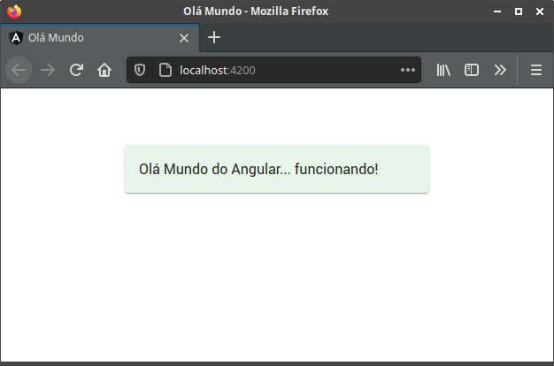

# Olá Mundo

Este projeto foi gerado com [Angular CLI](https://github.com/angular/angular-cli) versão 10.2.0.

## Servidor de desenvolvimento

Executando o comando `ng serve -o` para um servidor de desenvolvimento. O navegador será aberto automaticamente em `http://localhost:4200/`. O aplicativo será recarregado automaticamente se você alterar qualquer um dos arquivos.

 

